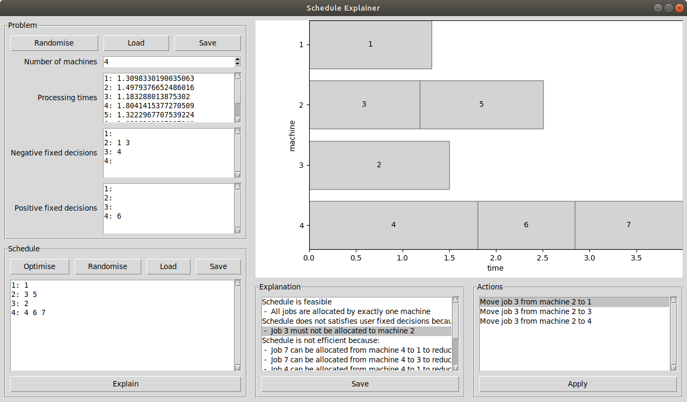
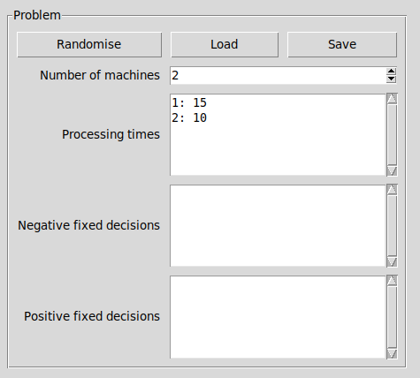
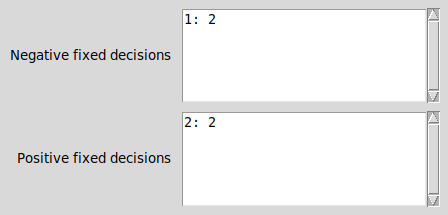
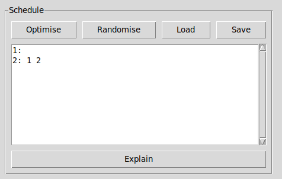
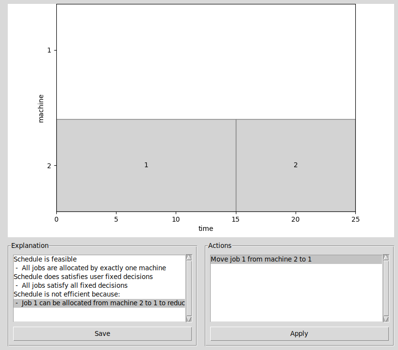
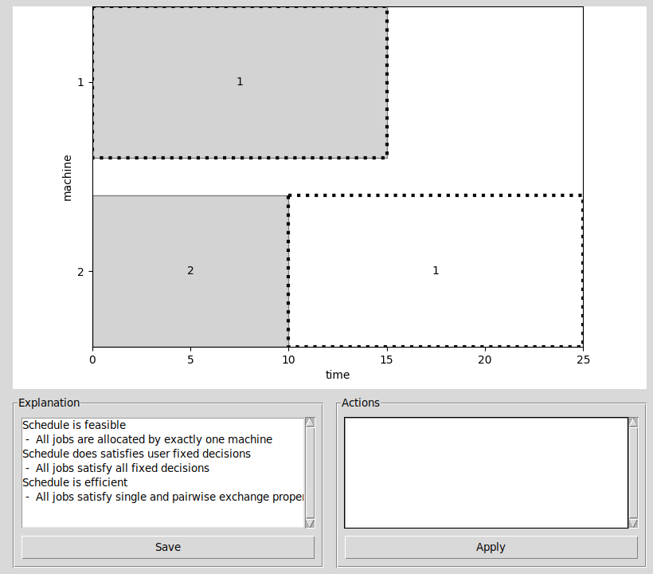

## A tool explain makespan [schedules](https://en.wikipedia.org/wiki/Schedule) using [abstract argumentation frameworks](https://en.wikipedia.org/wiki/Argumentation_framework)

Figure: Tool GUI showing problem and schedule input and explanation output

### Abstract

Scheduling arises in countless decision processes and has a wide range of practical applications, such as in healthcare. Scheduling problems are modelled using mathematics, where optimisers can find solutions to large scheduling problems quickly. Such optimisers are often complex with non-accessible formulations of scheduling, resulting in users interpreting solvers and solutions as black-boxes. Users require a means to understand why a schedule is reasonable, which is hindered by black-box interpretations.

### Installation

This assumes a Ubuntu 18.04 system. The tool optionally depends on [GLPK](https://www.gnu.org/software/glpk/) and libraries to interface  and visualise solvers. These are installed by running:
- `apt install glpk-utils`
- `apt install python-glpk`
- `pip3 install matplotlib`
- `pip3 install pillow`
- `pip3 install pyomo`

### How to use the tool

To start the tool, run `python3 main.py -g` in the src directory supplied in the repository.

The makespan problem consists of the number of machines and job processing times. The tutorial will use a hospital setting, where nurses and patients are represented as machines and jobs respectively. Consider the following example where there are two nurses, Alice and Bob. and two patients, Charlie and Dave. Charlie’s and Dave’s appointment takes 15 and 10 minutes respectively.

To enter the example in the tool, nurses and patients are indexed. Hence, A represents Alice, B represents Bob for nurses and 1 represents Charlie and 2 represents Dave for patients. Numbers are used to index machines and letters are used to index jobs. The problem is to minimise the total completion time, which intuitively is the longest time any nurse has to work.

Figure: Example problem input

Each line in the processing time textbox represents one job. The first line can be interpreted as: job A has processing time of 15 units, with following lines having similar interpretations. Negative fixed decisions represent jobs that cannot be assigned to machines. Positive fixed decisions represents jobs that much be assigned to a machine. Note that for all multi-line inputs, each line ends with a new line character.

Figure: Example fixed decisions input

Each line in each fixed decisions textbox represents one decision. The first line of negative fixed decisions can be interpreted as: machine 1 cannot be allocated to job B. The first line of positive fixed decisions can be interpreted as: machine 2 cannot be allocated to job B. In context of the example, this means Alice cannot be with Dave and Bob must be with Dave.

Figure: Example schedule input

After defining the makespan problem, enter the above schedule. The schedule can be interpreted as: machine 1 has no allocated jobs; machine 2 have two allocated jobs, A and B. The \texttt{Optimise} button finds the optimal schedule using a solver, which is by default GLPK. To specify a solver, starting the tool with `python3 main.py -g -S SOLVER_NAME` where `SOLVER\_NAME` is GLPK or CPLEX, for instance. Note that for large problems, optimisation may take a long time, so a solver time limit can be enforced by starting the tool with `python3 main.py -g -t TIME\_LIMIT` where `TIME\_LIMIT` is in seconds. The `Randomize` button generates some feasible schedule, which may violate fixed decisions. To explain the schedule, click the `Explain` button.

Figure: Example explanation output

The explanation reasons on three concepts: feasibility, satisfaction of fixed decisions and efficiency. Feasibility ensures that each job is allocated once. Satisfaction of fixed decisions ensures the schedule does not violate negative and positive fixed decisions specified in the problem. Efficiency regards suggestions to improve the total completion time. To improve the schedule, select a line in the explanation listbox to address, then select a line in the actions listbox. An line of explanation may have many different approaches to address the problem or schedule. Click on the `Apply` button to improve the schedule.

Figure: Example improved schedule

The example schedule only required one action to make the schedule efficient. However, many iterative actions may be required to reach an efficiency schedule. No further actions show that the schedule is feasible, satisfies fixed decisions and is efficient. The dot-highlighted boxes in the cascade chart illustrate newly and removed allocations compared to before the applying the action.
